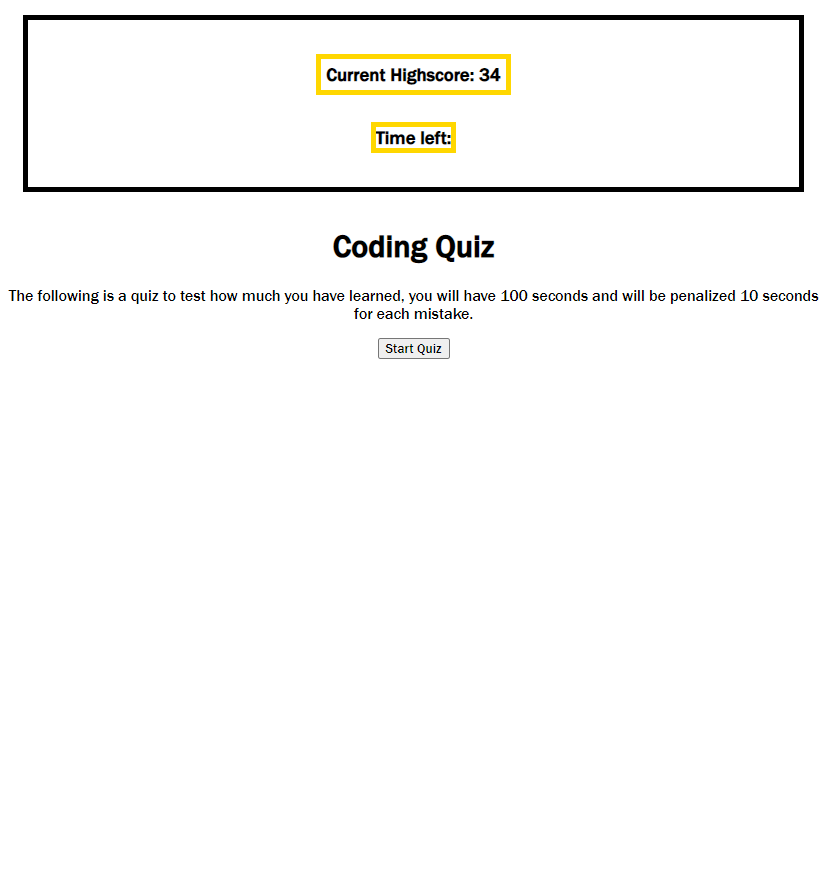

# Coding-quiz

## Description

A quiz that when you click the start button the timer starts and you are
presented with a series of question's. Get the question correct and you go on to the next question without penalty, but if you get the question wrong 10 seconds will be taken off your timer which at the end is your score. When all 10 questions have been answered or if the timer reaches 0, then the quiz is over. The game over screen has an option to save your score and to restart the quiz. 

## Link 

<a href="https://ivabon.github.io/04-code-quiz/">link to website </a>

## Screenshot 

